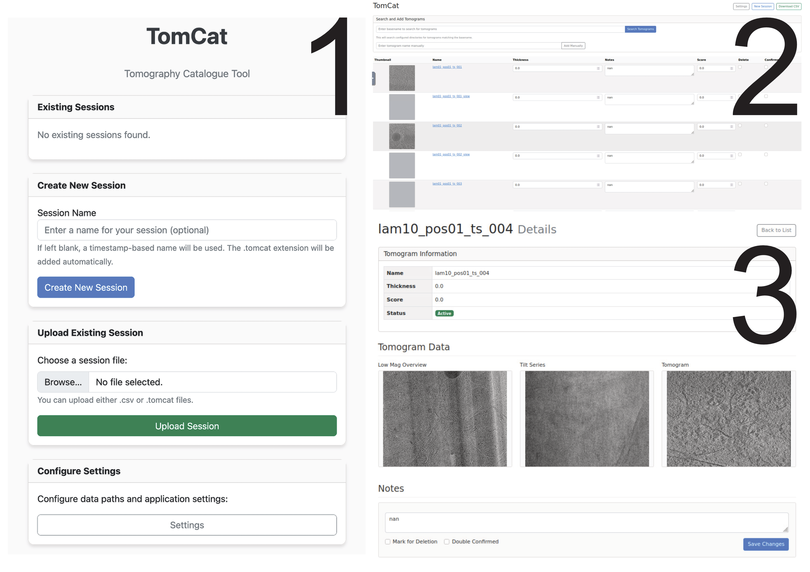

# TomCat - Tomography Catalogue Tool

TomCat is a web-based tool for cataloging and managing tomography data, providing an easy way to view, annotate, and organize tomograms.

## Features

- Browse and manage tomograms with an intuitive web interface
- View low-mag overviews, tilt series animations, and tomogram animations
- Add notes, scores, and other metadata to tomograms
- Search for tomograms across multiple data directories
- Autosave and export session data as CSV files and gifs as well as thumbnails

## Installation

```bash
conda create -n tomcat python=3.10
conda activate tomcat
git clone https://github.com/shahpnmlab/tomcat.git
cd tomcat
pip install -e .
```

## Quick Start

1. Start the TomCat web application:

```bash
tomcat run
```

2. Open your web browser and navigate to http://127.0.0.1:16006

3. Configure the data directories in the Settings page

4. Create a new session or upload an existing one

5. Start cataloging your tomograms!

## Command Line Interface

TomCat provides a command-line interface for common operations:

```bash
# Start the web application
tomcat run

# Run with custom host and port
tomcat run --host 0.0.0.0 --port 8080

# Initialize configuration
tomcat init

# Display information about current configuration
tomcat info
+---------------------------------------------------------+
|TomCat - Tomography Catalogue Tool                        |
|Configuration file: /path/to/proj_dir/.tomcat/config.json |
|App data directory: /path/to/proj_dir/.tomcat             |
|Configured paths:                                         |
|  lowmag_path: Not configured                             |
|  tiltseries_path: /path/to/proj_dir/tilt_series/dir      |
|  tomogram_path: /path/to/proj_dir/tomo                   |
|  notes_path: /path/to/proj_dir/                          |
|                                                          |
|Available sessions (1):                                   |
|  test.tomcat - 2025-03-10 21:18:53 (1 entries)           |
+---------------------------------------------------------+
```

## Requirements

- Python 3.7 or higher
- Flask
- Typer
- Pandas
- NumPy
- mrcfile
- Pillow
- imageio

## License

This project is licensed under the MIT License - see the LICENSE file for details.
